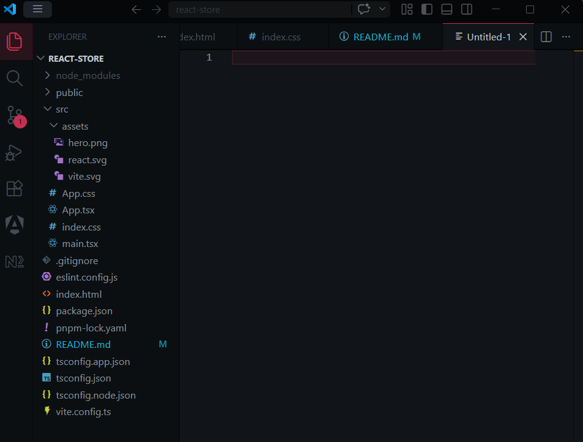
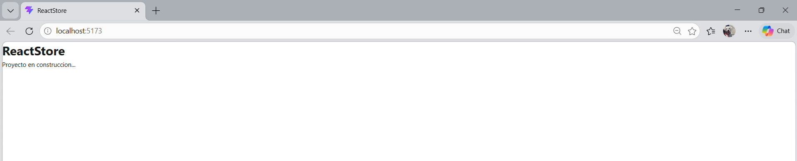
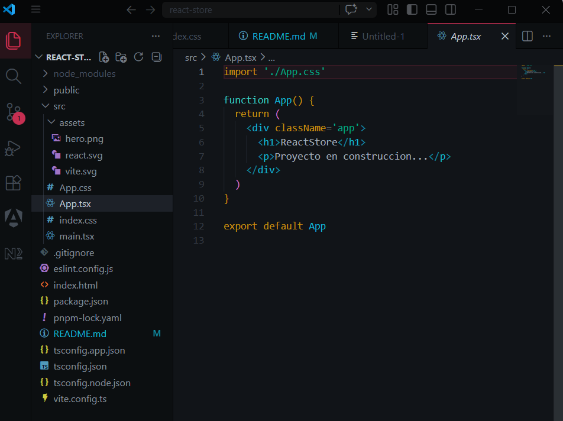
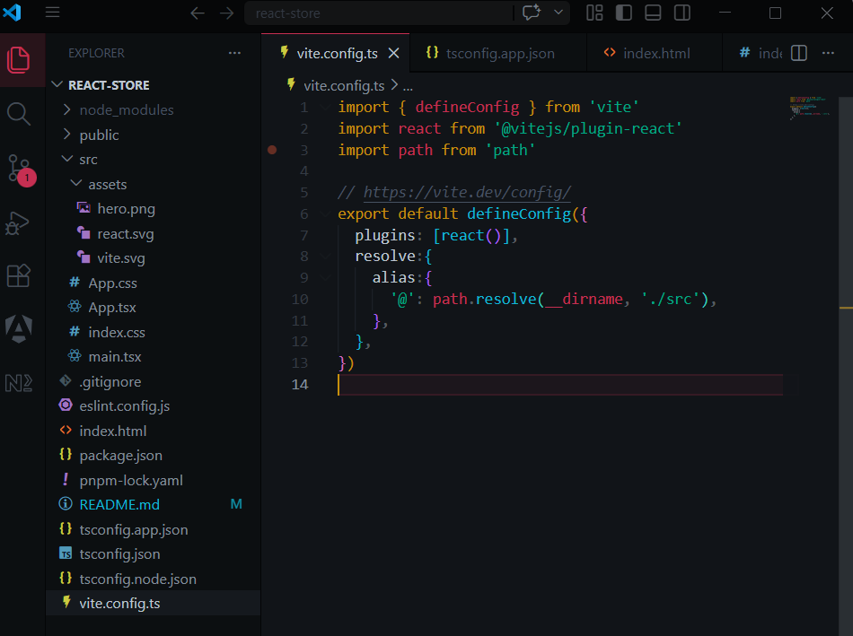
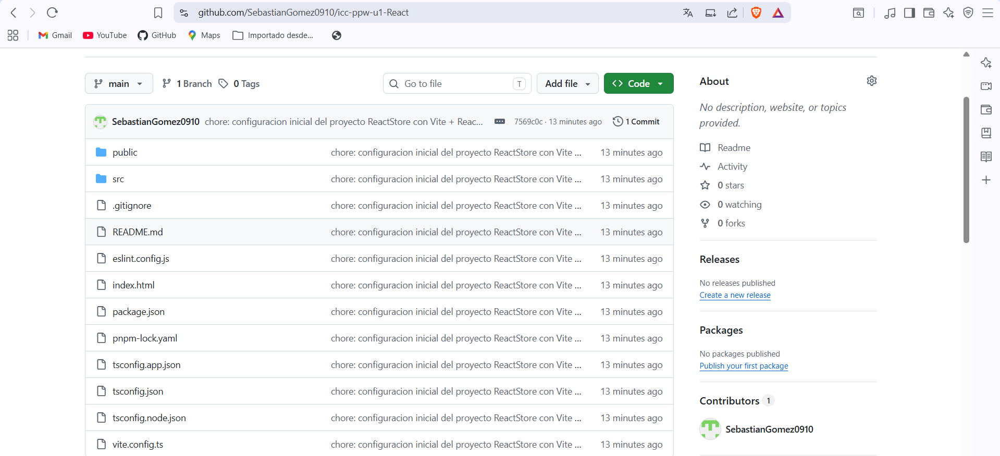

# MATERIAL ENTREGABLE

### 1. Proyecto de react-store creado con `Vite` + `React` + `TypeScript`

### 2. Servidor de desarrollo corriendo sin errores en `http://localhost:5173`

### 3. Boilerplate de Vite reemplazo por el componente `App` limpio

### 4. Alias `@` configurado en Vite y TypeScript

### 5. Primer commit realizado

